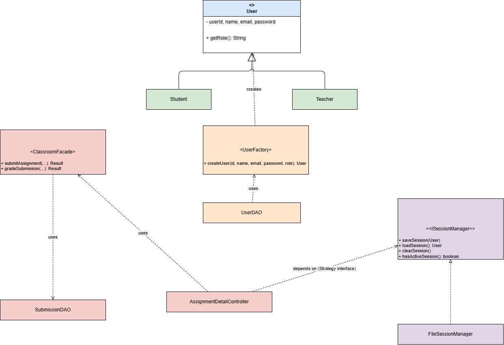

# MS Teams for Education Capstone

## Overview

This project is a JavaFX desktop application modeling two core scenarios from an MS Teams style classroom platform: assignment submission and grading, and class channel messaging. It connects to a MySQL database through XAMPP for all persistent data (users, assignments, submissions, channels, and messages).

## Major Features

The system supports two types of users, Students and Teachers, each with their own registration and login, and each landing on a completely different dashboard after logging in.

A Student can browse assignments, view assignment details, and submit a file before the due date. Submission is blocked automatically if the deadline has passed or if no file was attached.

A Teacher can create, edit, and delete assignments, and can view and grade the submissions students have sent in for each assignment.

Both Students and Teachers can post messages in a shared class channel, and can delete their own messages.

## Serialization and Session Management

When a user logs in successfully, their account information is written to a file called session.dat using Java's built in object serialization (ObjectOutputStream). This file is what the rest of the application actually checks to determine who is currently logged in, rather than relying only on a variable that would reset the moment the program restarts.

Every screen that needs to know the current user, such as the dashboards, the assignment submission screen, and the class channel, reads that information back in from session.dat through a class called FileSessionManager. This means the session genuinely persists at the file level while the user moves between screens, and even across restarting the application, since Main checks on startup whether session.dat already exists and sends the user straight to their dashboard if it does.

When the user logs out, session.dat is deleted immediately, and the user is redirected back to the login screen. At that point there is no longer any file to read, so the application correctly requires logging in again.

The classes involved in this feature are User (made serializable so it can be written to the file), ISessionManager (the interface describing what a session manager can do), and FileSessionManager (the concrete implementation that actually reads and writes session.dat).

## SOLID Principles Applied

### Single Responsibility Principle

Each class in this project is responsible for exactly one concern. The DAO classes, UserDAO, AssignmentDAO, SubmissionDAO, ChannelDAO, and MessageDAO, are only responsible for talking to the database for their one corresponding table. The controller classes, such as LoginController, ManageAssignmentsController, and ChannelController, are only responsible for handling what happens on screen and responding to button clicks. The model classes, such as Assignment, Submission, and Message, are only responsible for holding data, with no database code or user interface code inside them at all.

The benefit of this separation is that if the database structure changes, only the relevant DAO class needs to change. If a screen's layout or button labels change, only the relevant controller needs to change. Nobody has to touch three different kinds of logic just to make one small update.

### Dependency Inversion Principle

The session management feature described above is built around an interface called ISessionManager rather than a single hard coded class. Every controller that needs to know who is logged in, including LoginController, StudentDashboardController, TeacherDashboardController, AssignmentDetailController, ManageAssignmentsController, and ChannelController, depends only on the ISessionManager interface. They call methods like loadSession() and clearSession() without knowing or caring that the current implementation happens to use file based serialization underneath.

The concrete class FileSessionManager is what actually implements those methods using ObjectOutputStream and ObjectInputStream. Because the controllers depend on the abstraction rather than on FileSessionManager directly, the underlying session mechanism could be swapped out later, for example to store sessions in the database instead of a local file, and none of the controller code would need to change at all. That is the core benefit of the Dependency Inversion Principle: high level code (the controllers) does not depend on low level details (how a session is actually stored), it depends only on the interface describing what a session manager does.

## Design Patterns Applied

### Creational: Factory Method

The class UserFactory is responsible for creating the correct type of User, either a Student or a Teacher, based on the role value stored in the database. UserDAO calls UserFactory.createUser(...) instead of deciding which subclass to build itself. The benefit is that the decision logic for "which subtype of User do I build" lives in exactly one place, so if a third role were ever added later, only UserFactory would need to change.

### Structural: Facade

The class ClassroomFacade sits in front of SubmissionDAO and hides the individual steps involved in submitting or grading an assignment, such as checking the deadline, checking that a file was attached, and checking that a grade is a valid number, behind two simple methods, submitAssignment(...) and gradeSubmission(...). AssignmentDetailController and SubmissionsController call these two methods instead of performing every validation step themselves. The benefit is that the controllers stay focused on the user interface, while ClassroomFacade owns the actual business rules in one place.

### Behavioral: Strategy

ISessionManager defines the "algorithm" for handling a user session (save, load, clear, check) as an interface, and FileSessionManager is one concrete strategy for doing that using serialization to a file. Every controller that needs session information depends only on the ISessionManager interface, not on FileSessionManager specifically. The benefit is that the session strategy could be swapped for a different implementation later without changing any controller code, since they only ever call the interface's methods.

The updated class diagram showing these three classes, their stereotypes, and how they connect to the rest of the system is included as an image below.

## Setup

Start XAMPP and make sure MySQL is running. Open phpMyAdmin, create a database named msteams_db, and run the script found in sql/schema.sql from the SQL tab. Then open this project folder in IntelliJ, let it download the JavaFX and MySQL Maven dependencies, and run Main.java.

## Known Limitations

Passwords are currently stored as plain text rather than hashed, which is acceptable for a class capstone but would need to change for a real deployment. There is no real file upload for assignments yet, only a text field for a file name.
